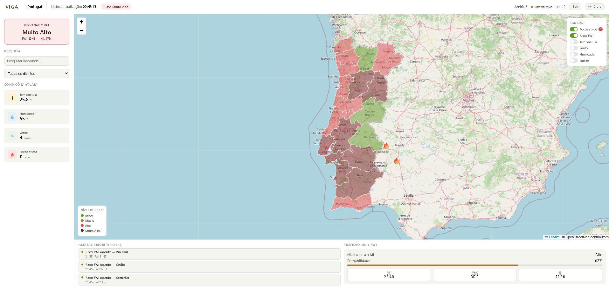
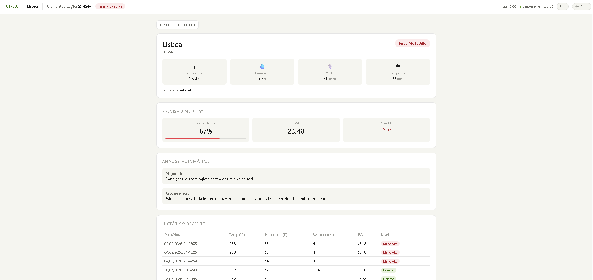

# 🔥 VIGA — Intelligent Surveillance and Alert Management

A wildfire risk prediction system for Portugal that integrates real-time weather data, satellite-detected fire hotspots, and machine learning models trained on historical Portuguese data — all presented through an interactive web dashboard with a district-level map.

Developed as a **Final Year Project — ISTEC** (2026).

---

## 📸 Screenshots







---

## ✨ Features

- 🗺️ **Interactive map** of Portugal's 18 districts with real-time fire risk levels
- 🛰️ **Active fire hotspots** via satellite (NASA FIRMS), filtered to Portuguese territory
- 🌡️ **Real-time weather data** (temperature, humidity, wind, precipitation) updated hourly
- 🤖 **Machine learning ensemble** (two XGBoost models) combining historical data from ANPC and Kaggle
- 🔥 **Fire Weather Index (FWI) calculation**, the Canadian wildfire danger rating system used by ANPC
- 🔍 **Location search** across 3,258 regions in Portugal
- 🔐 **JWT authentication** with protected routes
- 🐳 **Fully dockerized**, with separate development and production environments

---

## 🏗️ Architecture

```
┌─────────────────┐     ┌─────────────────┐     ┌─────────────────┐
│    Frontend      │────▶│      Nginx      │────▶│     Backend      │
│  React + Vite    │     │  Reverse Proxy  │     │     FastAPI      │
└─────────────────┘     └─────────────────┘     └────────┬────────┘
                                                            │
                                        ┌───────────────────┴───────────────────┐
                                        │                                       │
                                ┌───────▼────────┐                    ┌────────▼────────┐
                                │   PostgreSQL     │                    │  External APIs   │
                                │   + PostGIS      │                    │  Open-Meteo      │
                                └─────────────────┘                    │  NASA FIRMS      │
                                                                        │  IPMA            │
                                                                        └─────────────────┘
```

---

## 🛠️ Tech Stack

| Layer | Technology | Why |
|-------|-----------|-----|
| Backend | **FastAPI** (Python) | Async support, automatic validation with Pydantic, native OpenAPI docs |
| Database | **PostgreSQL + PostGIS** | Native geospatial support, robust for time-series data |
| Frontend | **React + Vite** | Mature ecosystem, fast hot reload |
| Map | **Leaflet.js** | Open-source, GeoJSON support, no API costs |
| Machine Learning | **XGBoost Ensemble** | Best performance on tabular weather data |
| Infrastructure | **Docker Compose** | Reproducible environment, separate dev/prod profiles |
| Authentication | **JWT** | Stateless and scalable |

---

## 🤖 Machine Learning Models

The system combines two independent XGBoost models, weighted by geographic relevance:

| Model | Dataset | Records | Weight | Accuracy |
|-------|---------|---------|--------|----------|
| ANPC | Rural fire occurrences in Portugal (2016–2020) | 54,402 | 60% | 81% |
| Kaggle | Forest Fires (FWI) | 517 | 40% | 60% |

The **ICNF** dataset (274,986 occurrences, 1980–2015) was analyzed but excluded from the ensemble due to missing geographic coordinates.

---

## 🌐 External APIs

- **[Open-Meteo](https://open-meteo.com/)** — real-time weather data, free and no API key required
- **[NASA FIRMS](https://firms.modaps.eosdis.nasa.gov/)** — satellite fire hotspots via VIIRS SNPP (Near Real Time)
- **[IPMA](https://www.ipma.pt/)** — official Portuguese weather forecasts
- **OpenStreetMap / Overpass API** — 3,258 regions and localities across Portugal

---

## 🚀 Running the Project

### Development

```bash
docker compose up -d
```

Access at `http://localhost:5173`

### Production

```bash
docker compose -f docker-compose.prod.yml --env-file .env.prod up -d
```

Access at `http://localhost`

---

## 📁 Project Structure

```
viga/
├── backend/          # FastAPI: routes, services, ML models
├── frontend/         # React + Vite: dashboard, map, authentication
├── docker/           # Development and production Dockerfiles
├── ml/notebooks/     # Model training notebooks
├── database/seeds/   # Initial seed SQL scripts
└── docs/             # Detailed technical documentation
```

---

## 🧩 Technical Challenges Solved

Several real engineering problems were identified and resolved during development, including:

- A scheduler that silently stopped due to uvicorn's `--reload` mode restarting the child process
- Fire hotspots from Spain appearing on the map due to the API's rectangular bounding box
- Version incompatibility between `bcrypt` and `passlib`
- Failed district-name matching between accented GeoJSON names and unaccented database entries

📄 The full breakdown of technical decisions, architecture, and challenges is documented in [`docs/decisoes_tecnicas.md`](docs/decisoes_tecnicas.md).

---

## 👤 Author

**Daniel Rombo**
Final Year Project — ISTEC, 2026